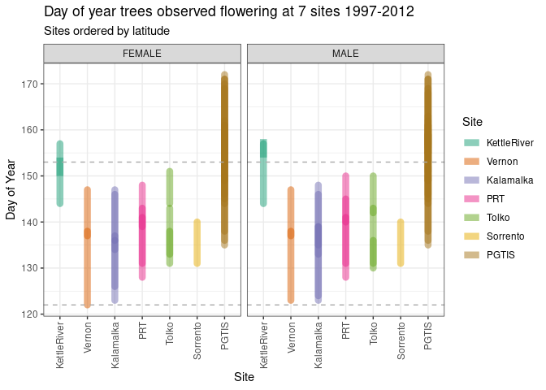

<!-- README.md is generated from README.Rmd. Please edit that file -->

# picolaDataFlowering

<!-- badges: start -->

[](https://github.com/scisus/picolaDataFlowering/actions/workflows/R-CMD-check.yaml)
[](https://doi.org/10.5281/zenodo.14597484)
<!-- badges: end -->

The goal of `picolaDataFlowering` is to provide a lodgepole pine
flowering phenology dataset in an accessible format. This package
contains 16 years of interior lodgepole pine (*Pinus contorta* ssp.
*latifolia*) phenology data for pollen shed and cone receptivity.

The data were collected in seed orchards in British Columbia between
1997 and 2012. Orchard trees are clones and offspring of parents sourced
from across the province. Seed orchards measured pollen shed, cone
receptivity, date cones were picked, and the weight of the cones. Not
all orchards measured all variables in all years. Only pollen shed and
cone receptivity are surfaced in the package, but date of cone harvest
and weight are available in the raw data.

## Installation

You can install the development version of `picolaDataFlowering` from
[GitHub](https://github.com/) with:

``` r
# install.packages("devtools")
devtools::install_github("scisus/picolaDataFlowering")
```

## Example

Read in phenology data sets from the package.

``` r
## basic example code

state <- picolaDataFlowering::picola_state
head(state)
#>   Index DoY       Date Phenophase_Recorded State    Sex Year  Site Orchard
#> 1   343 148 1997-05-28                   4     2 FEMALE 1997 PGTIS     220
#> 2   343 150 1997-05-30                   4     2 FEMALE 1997 PGTIS     220
#> 3   343 153 1997-06-02                   4     2 FEMALE 1997 PGTIS     220
#> 4   343 155 1997-06-04                   -     3 FEMALE 1997 PGTIS     220
#> 5   343 157 1997-06-06                   -     3 FEMALE 1997 PGTIS     220
#> 6   343 159 1997-06-08                   -     3 FEMALE 1997 PGTIS     220
#>   Genotype Tree X  Y      Source
#> 1      980   28 D 47 Rita Wagner
#> 2      980   28 D 47 Rita Wagner
#> 3      980   28 D 47 Rita Wagner
#> 4      980   28 D 47 Rita Wagner
#> 5      980   28 D 47 Rita Wagner
#> 6      980   28 D 47 Rita Wagner

event <- picolaDataFlowering::picola_event
head(event)
#>   Index State Year DoY      Event_Label Event_Obs       Date    Sex      Site
#> 1     1     1 2006 125 before_flowering         1 2006-05-05 FEMALE Kalamalka
#> 2     1     2 2006 126  first_flowering         2 2006-05-06 FEMALE Kalamalka
#> 3     1     2 2006 127   last_flowering         3 2006-05-07 FEMALE Kalamalka
#> 4     1     3 2006 128   past_flowering         4 2006-05-08 FEMALE Kalamalka
#> 5     2     1 2006 124 before_flowering         1 2006-05-04 FEMALE Kalamalka
#> 6     2     2 2006 125  first_flowering         2 2006-05-05 FEMALE Kalamalka
#>   Orchard Genotype Tree X  Y      Source
#> 1     230     1460   NA N 18 Chris Walsh
#> 2     230     1460   NA N 18 Chris Walsh
#> 3     230     1460   NA N 18 Chris Walsh
#> 4     230     1460   NA N 18 Chris Walsh
#> 5     230     1467   NA J  5 Chris Walsh
#> 6     230     1467   NA J  5 Chris Walsh
```

Lodgepole pine in BC generally flowers in May and June.



Data is from 259 genotypes grown at 7 BC seed orchard sites and observed
between 1997 and 2012.

Data sets provided with this package include:

- `picola_event` and `picola_state`: two versions of the flowering
  phenology data. `picola_event` is formatted for the model in
  [picolaModel](https://github.com/scisus/picolaModel) and contains only
  the observations necessary for the model. `picola_state` contains all
  observations and original phenology coding.
- `picola_parent_locs`: provenance information for genotypes grown in
  the orchards
- `picola_site_coord_elev`: locations and elevations of seed orchard
  sites and two northern sites used for comparison in
  [picolaModel](https://github.com/scisus/picolaModel) analysis
- `picola_SPUs`: lodgepole pine SPUs and their representation in this
  phenology dataset
